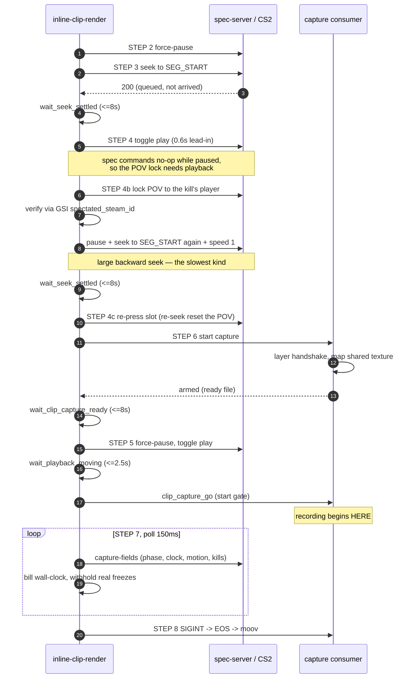

# Highlight clip render pipeline

How a batch pod turns a demo + a queue of clip jobs into uploaded highlight clips.
Covers the queue, one job's steps, and — in the most detail — what happens inside a
single segment, since that's where every timing bug so far has lived.

Source of truth for the behaviour described here:

| Layer | File |
| --- | --- |
| Batch queue | `src/lib/batch-highlights.sh` |
| One job, one segment | `src/lib/inline-clip-render.sh` |
| Capture lifecycle | `src/lib/clip-capture.sh` |
| Capture consumer | `src/vkcapture/vkcapture-consumer.c` |
| Demo/GSI endpoints | `src/spectator/routes/` |

---

## 1. The queue

A **job** is one player's kills in one round — the spec carries `round`, `kills_count`
and a `segments[]` list, one segment per kill (`start_tick`, `end_tick`, `kill_tick`,
`pov_steam_id`).

Jobs never render in parallel: each drives the shared CS2 process exclusively. Only the
tail — thumbnail extraction and upload, which touch nothing but disk and network —
overlaps the next job's capture.

```mermaid
gantt
    title Batch pod: one demo, one CS2, N jobs in series
    dateFormat X
    axisFormat %s

    section CS2 (exclusive)
    wait demo-ready (GSI + demoui hidden)   :crit, 0, 7
    warm-up 4x (uncaptured)                 :done, 7, 9
    job 1 capture (round 14, 3 kills)       :active, 9, 14
    job 2 capture (round 19, 2 kills)       :active, 14, 18
    job 3 capture (round 22, 4 kills)       :active, 18, 23

    section Assemble
    concat 1                                :14, 16
    concat 2                                :18, 20
    concat 3                                :23, 25

    section Upload tail (overlaps)
    thumb + upload 1                        :16, 20
    thumb + upload 2                        :20, 24
    thumb + upload 3                        :25, 29
```



CS2 is released at the `.cs2done` marker — written right after concat, **before** the
upload — which is what lets job N+1 start seeking while job N is still uploading.

### Queue rules

| Rule | Knob | Why |
| --- | --- | --- |
| Wait for the demo to be render-ready before job 1 | `DEMO_READY_TIMEOUT` (300s) | Seeking an unloaded demo lands on tick 0 and captures black. Requires GSI to have fired **and** the demo UI panel to be hidden. |
| At most 2 upload tails in flight | `CLIP_BATCH_MAX_TAILS` (2) | A slow API would otherwise stack every finished clip on local disk at once. The oldest is reaped before the next job starts. |
| Warm the Vulkan pipelines once per CS2 process | `CLIP_WARMUP_RATE` (4x) | Replays the first segment's range at 4x with nothing recording, so pipeline compilation doesn't land inside a real capture. Guarded by a marker file, dropped when a fresh CS2 starts. |
| An engine fatal kills the rest of the batch | `CS2_FATAL_SENTINEL` | Once CS2 dies, remaining jobs are failed fast with a reason instead of capturing frozen frames. |

---

## 2. One job

These are the `STEP` labels as they print in the render log, in order.

| Log label | What it does |
| --- | --- |
| `STEP 1` | Snapshot the demo state (tick, paused) so the job can be undone. |
| `STEP 1b` | `spec_autodirector 0` — otherwise CS2's director fights the POV lock and the camera flickers at segment starts. |
| `STEP 1a` | Stop the live capture (live pods only — the GPU encoder can't serve stream and clip at once). |
| prep | Decide branding; **defer** the Remotion player-chip render. Running it during a capture caused a visible stutter, so it's kept outside the capture window. |
| warm-up | Replay the first range at 4x, uncaptured. Once per CS2 process. |
| `STEP 2`–`STEP 8` | **Segment loop**, once per kill. Each pass writes one `seg-NNN.mp4`. See below. |
| polish | Burn the chip overlay into each segment, backgrounded so it overlaps the next segment's capture. Reaped before assembly. |
| `STEP 9` | Concat segments + append the outro. Tries a stream copy first and verifies the output duration; falls back to a filter-graph re-encode if the copy is refused or the duration drifts >2s. Direct cuts, no fades — crossfades compounded with CS2's seek-load frames into ~1s of dead air per join. |
| `STEP 9a` | Restart the live capture, then touch the release marker — this is the handoff that lets the next job start. |
| tail | Extract a thumbnail, upload the clip. Runs after CS2 is already handed over. |

---

## 3. One segment

Everything here exists because **`POST /demo/seek` returns as soon as the seek is
*queued***. CS2 executes it asynchronously and slowly, and a backward seek replays from
tick 0 — which is what every segment does.



### The playhead

Demo tick against wall-clock time, for one segment. Dashed = seek (playhead sweeps back
through tick 0), solid = real playback.

```
 tick
   |                                                        ,-* END
   |                                                    ,--'
   |                                                ,--'
   |                                            ,--'
   |                                        ,--'
   |                                    ,--'      <- recorded window
   |         _.-*                   ,--'
   |     _.-'                   ,--'
 START *'         *===========*'
   |   /\         /\           ^ gate opens (playback confirmed moving)
   |  /  \       /  \
   | /    \     /    \         *=====*  held paused (capture arming +
   |/      \   /      \                  CS2 digesting the unpause)
   0 -------\-/--------\-/------------------------------------------> wall clock
        seek back    seek back again
        (STEP 3)     (STEP 4c)
```

### What lands in the file

| | |
| --- | --- |
| **Reaches the mp4** | Only the final play-through: from the moment the demo is confirmed moving, until the wall-clock budget is spent. |
| **Never recorded** | Both backward seeks, the 0.6s lead-in, POV-lock polling, the capture handshake, and the frame CS2 holds while it digests the unpause. |
| **Recorded but not billed** | A mid-clip freeze, detected via a flat GSI phase clock, is withheld from the budget so the kill isn't cut off — capped at `CLIP_UNBILLED_CAP_MS` (2200ms). |

### The start gate

The capture is deliberately spawned **while the demo is still paused at `SEG_START`**, so
that recording opens exactly at the pre-roll rather than wherever the demo drifted to. But
spawning is not recording, and CS2 holds the paused frame for a while after a big backward
unpause — so the consumer separates *armed* from *recording*:

1. `VKCAP_READY_FILE` is touched when the shared texture is mapped — **armed**. The
   renderer waits for this before pressing play.
2. `VKCAP_START_FILE` holds the pipeline in `READY`, discarding CS2's frames, until
   `clip_capture_go` touches it.
3. Going `PLAYING` happens on the first frame after the gate opens, so the pulsesrc audio
   starts in lockstep with the first *recorded* video frame.

Without `VKCAP_START_FILE` the consumer arms and records immediately — that's the path the
live stream uses, and it's unchanged.

---

## 4. Every wait, and what happens when it expires

Nothing blocks forever. The standing rule is that a late clip beats no clip.

| Gate | Signal | Ceiling | On expiry |
| --- | --- | --- | --- |
| Demo ready | GSI fired **and** `demoui_hidden` | `DEMO_READY_TIMEOUT` 300s | Fails the whole batch with a reason so the node frees instead of hanging. |
| Seek settled | `/demo/seek-state` reports the gototick finished | `CLIP_SEEK_SETTLE_TIMEOUT_MS` 8s | Proceeds anyway. Motion is **not** usable here — the backward replay sweep moves the world and ticks the round clock, so a motion check reads "playing" mid-sweep. |
| POV locked | GSI `spectated_steam_id` matches the target | 2 tries | Re-presses the slot once, then proceeds on whatever POV CS2 has. |
| Capture armed | Consumer's ready file appears | `CLIP_CAPTURE_READY_TIMEOUT_MS` 8s | Starts playback anyway — the opening frames won't be in the file. |
| Playback moving | `phase_ends_in` or `world_motion` changes after the unpause | `CLIP_PLAY_CONFIRM_TIMEOUT_MS` 2.5s | Opens the gate regardless. Skipped outright when GSI is stale (no signal to wait for). |
| Start gate backstop | Consumer polls for the go file each frame | `VKCAP_START_TIMEOUT_MS` 10s | Records anyway, so a renderer that never signals yields a late clip rather than an empty one. |
| Segment budget | Wall clock, billed per 150ms poll | `CLIP_SEGMENT_TIMEOUT_FACTOR` 2x duration | Hard stop for a wedged demo, tight enough that a misfire can't run deep into the next round. |
| Capture drain | SIGINT → EOS → qtmux writes the moov atom | 15s | Polls at 100ms; every extra poll is dead time between segments. |

Worst case these compound: a single segment can spend ~18s in setup gates before recording
a frame. In practice each one returns in well under a second.

---

## 5. What cuts a segment short

The record loop doesn't only count down.

| Condition | Detection | Action |
| --- | --- | --- |
| Round bleed | GSI round number advances past the one the segment opened in | Stops immediately — the clip has run out of its round. |
| Match end | Map phase hits gameover (armed only for segments near the demo's end) | Stops early rather than recording the post-match screen. |
| Demo frozen | Phase clock flat for 2 consecutive polls | Withholds the time from the budget and kicks playback with pause→toggle, up to 4 times. |
| Demo never advanced | GSI signature identical across 12+ polls | Marks the CS2 session fatal and fails the job — the known engine replay bug. |
| Empty capture | Raw mp4 probes as zero-length or undecodable | Retries the segment once on the ximagesrc path, then drops it from the concat rather than silently truncating the montage. |

---

## Caveat: the ximagesrc fallback

The armed-but-holding state — and therefore the clean opening frame — exists only on the
vkcapture path (`CLIP_CAPTURE_METHOD=vkcapture`, the default, which needs
`nvidia-drm.modeset=1` on the host). The ximagesrc fallback grabs the screen the instant
its pipeline goes live, so it still records the held frame at the top of every segment.
